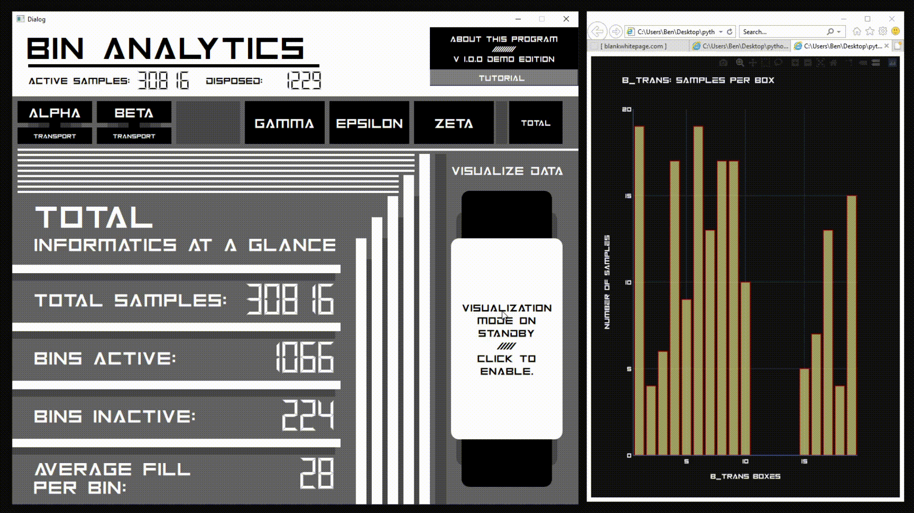
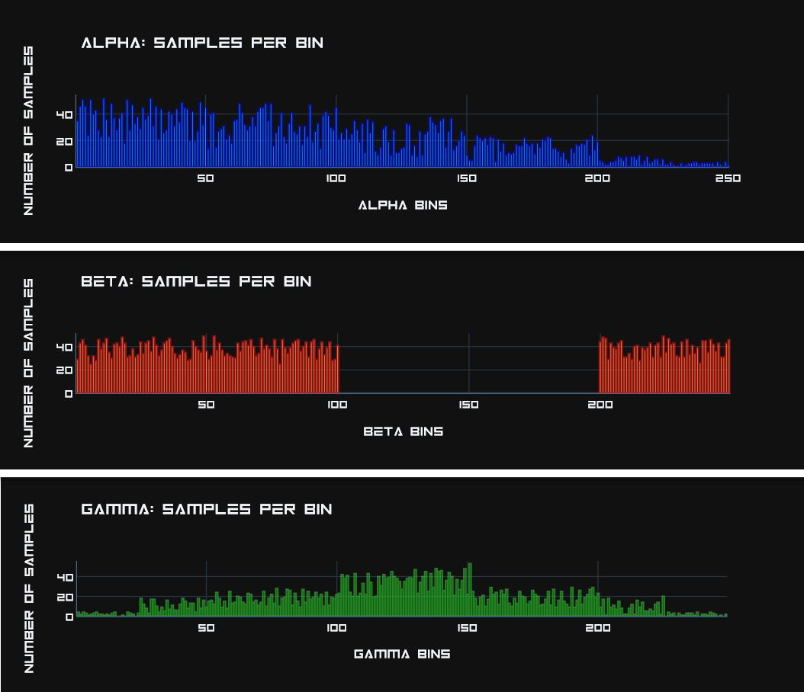

# BIN ANALYTICS: An Engaging Visualizer for WMS Sample Binning

#
 
#
This program provides a polished and interactive audiovisual experience for abstracted data points-- providing clarity for the frontend user and giving them the tools to execute  leadership decisions involving categorical inventory bloat, disposal, and consolidation. Conceptualized for official implementation in a qualilty laboratory to manage sample inventory, this public demonstration project has been designed from the ground-up to ensure complete abstraction of all company-sensitive information, technology, and structure.

# Role and Purpose:
Without a proper visualization tool, there is no preexisting framework that can natively provide large-batch logistical information for more than 50,000 annual data points through a proprietary WMS program. With clear metrics on how congested a binning parameter has become in the laboratory, company leadership can set thresholds that trigger sample disposals and consolidations.
* Additionally, the visualization mode allows an easy way for a front-end technician to view an easy statistical representation of a large physical inventory, and identify anomalies in the database.
(*Does a bin have an unusally-high number of samples? Are there outlying points that signify that a sample has been abandoned/forgotten? Are samples being stored according to categorical binning guidelines?*)

# Technologies
Built with **Python 3.8.1**

**Libaries to Install** (*Included in requirements.txt*)
* pandas == 1.0.4
* pygame == 1.9.6
* plotly == 4.8.2
* numpy == 1.18.5
* PySide2 == 5.15.0

# Running the Program:
After installing all necessary dependecies, the program can be launched via LAUNCH_BOX_ANALYTICS.py.
* After the splash screen, you may read more in-depth operation instructions via the Tutorial section in the top-right of the program. 

* After engaging **Visualization Mode** on the far-right of the GUI, you will automatically generate a bar graph when clicking on a parametric category (One of the black rectangles at the top of the GUI). This may be toggled off at any time by again clicking on the Visualization Mode button.

# What does the Database Represent? 
The respository's .db file is ficticious in content, and does not reflect internal information of any company, entity, or individual. It has been created via random generation of unique sample identifiers and binning categories. As deployed in an internal setting, the table structure works in a similar structural manner as what's in this this repo. (Bins, binned items, and disposal status-- and USER ID tracking.)

* All binning categories are procedurally generated from LAUNCH_GENERATOR.py-- which is a script that I wrote to dyanamically write large-batch information to a database that BIN ANALYTICS will pull from. Feel free to run the generator and see what sort of visualizations you get! :) 

This program performs operations on a locally-hosted SQLite3 database with five columns:

1) **Bin Number**: A physical bin that multiple **samples** are checked into with a proprietary inventory program. They carry a string-based prefix (Delineated in the demo version with the Greek Alphabet. In commercial use, these terms reflect important binning parameters for samples.)
2) **Sample**: Samples in each bin are affiliated with a unique access number that maps to the sample.
3) **Sample Check-In Information**: Records traceable user information to provide accounatability for placement of a sample in a bin.
4) **Disposal**: Either a null or date-based value that evaulates whether a sample is actively needed in the laboratory.
5) **Disposal Identification**: Records traceable user information to provide accountability for the removal of physical laboratory inventory.

# Alien Worlds: The Mock Data

For our theoretical inventory, imagine yourself on a spaceship that's in charge of holding five unique species of alien. Each year, tens of thousands of alien tissue samples are held on the ship, in one of 250 holding bins. Bins closer to 0 are held in colder conditions, and bins closer to 250 are held in hotter conditions. Different alien species must have their tissue differently distributed in their species' bins according to their curation needs.

ALPHA:
* Alpha tissue samples do not have hard temperature limits regarding their storage, although colder temperatures are preferred. When the average number of alpha tissue samples per bin exceeds 20, it is important to spread out the samples across the available storage range, in a downward linear manner.

BETA:
* These tissues samples are sensitive to mid-warm temperatures, and must be stored from cold-to-mid temperatures, and in hot temperatures-- but storing these alien tissues in the upper-middle of the bin range is never reccomended.

GAMMA:
* These samples should be stored in a bell distribution-- with the majority of tissue samples in the middle of the bin range.

EPSILON:
* An alien species known for their hot homeworld, it is never reccomended to store epsilon tissue at a colder temperature. Therefore, one should favor the bins on the higher limit.

ZETA:
* Zeta aliens are our most adaptable species, and are to be stored in a stochastic manner across all of our available bins. It's important to have a wide variety of Zeta tissue storage conditions for research!

#
